# Amazing Atoms

Welcome to Amazing Atoms! Amazing Atoms is an interactive quiz game where users can test and improve their knowledge about atoms. There are four possible answers for each question and once the user selects an answer, the correct answer is shown and explained for each question, so they can learn about atoms as they play! 

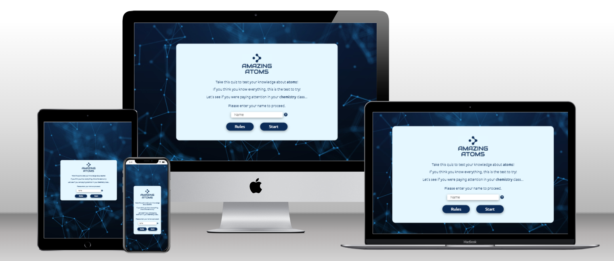

## Live Website
[Amazing Atoms](https://shizukadonaghue.github.io/atomic-quiz/)

## Repository
<https://github.com/ShizukaDonaghue/atomic-quiz>

## UX & Desgin
### Overview
Amazing Atoms has been designed to help users test and improve their knowledge about atoms, regardless of their level of knowledge. The overall objective of the game is for users to have some fun while they learn about atoms.  

### User Stories
As a user,
* I would like to test and improve my knowledge about atoms
* I would like a clean and uncluttered website that is intuitive and easy to navigate
* I would like to be able to play the game on any devices
* I would like to understand how to play the game
* I would like clear visual feedback when I submit my answer so that I know whether my answer is correct
* I would like to know how well I did in the game when finished

### Website Structure
The website consists of two HTML pages. The main page contains all the contents related to the game and the second page is only used in case of 404 error. 

The contents for the game are on a single HTML page and JavaScript scrits in script.js are used to hide and unhide sections of the main page based on the intractions with the user. For example, the landing page is the start section of the main page and when the user clicks on the start button to play the game, the start section is hidden and the game section is displayed. Once the game is initiated, a series of randomised questions is displayed which are stored in questions.js file. 

### Wire Frames
Wireframes were generated using [balsamiq](https://balsamiq.com/) to visualise the structure of the website. The structure of the finished website is slighly different from the wireframes due to development that occurred during the building process, however, the main structure remained the same.

  
Mobile

  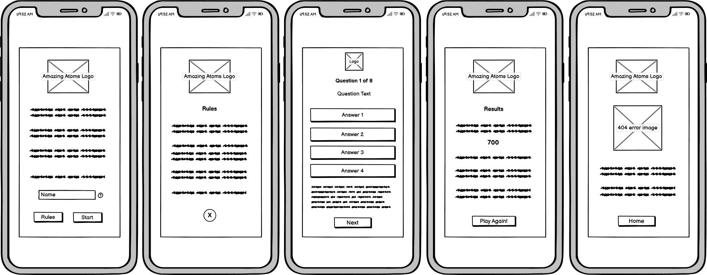

  
Tablet

  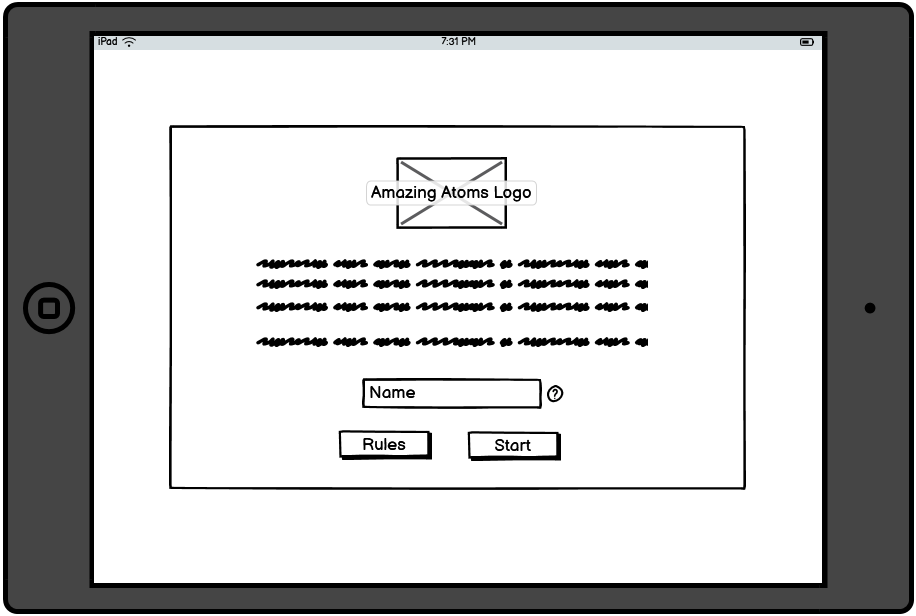
  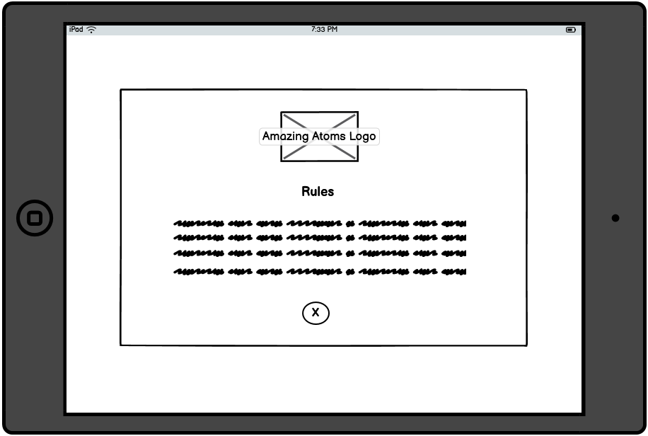
  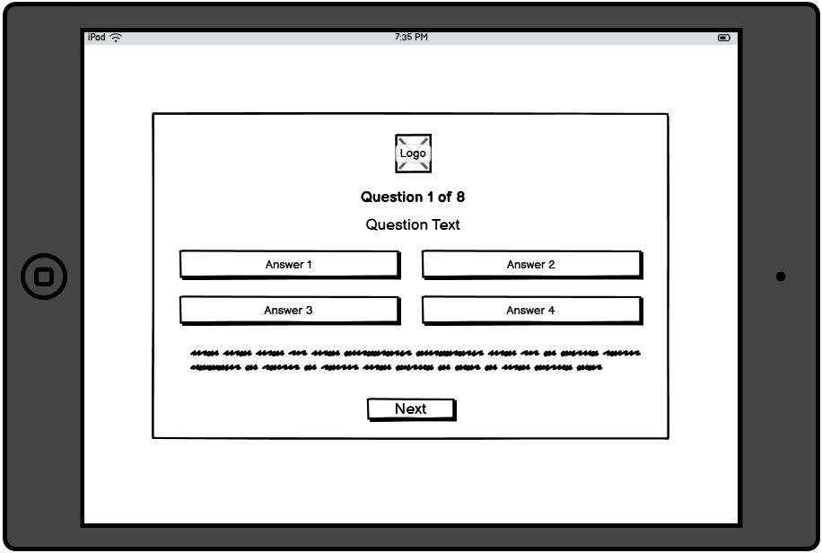
  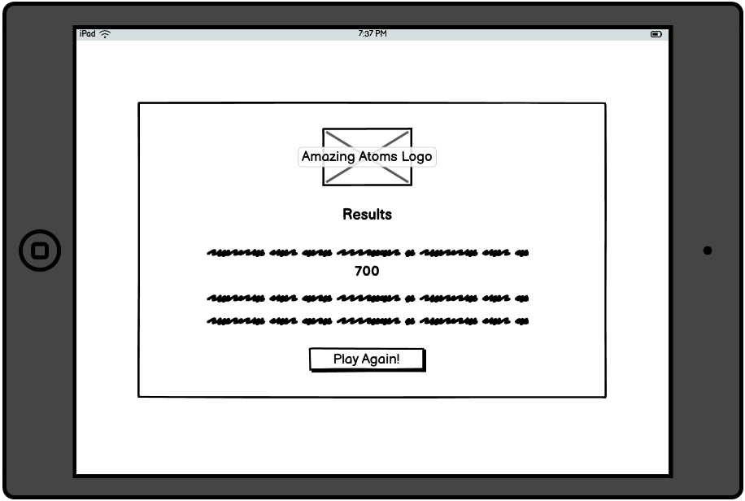
  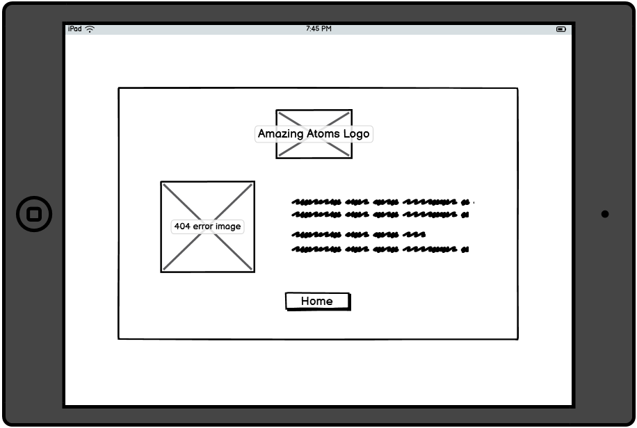

  
Desktop

  
  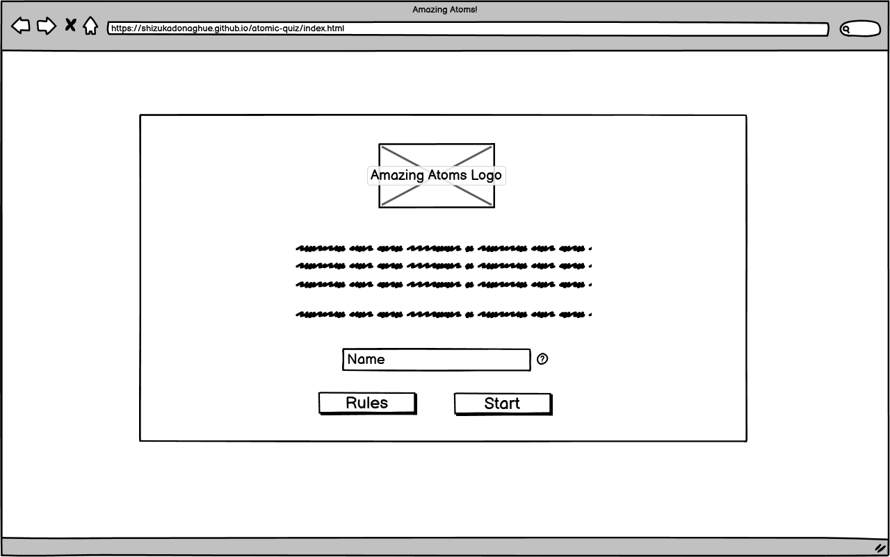
  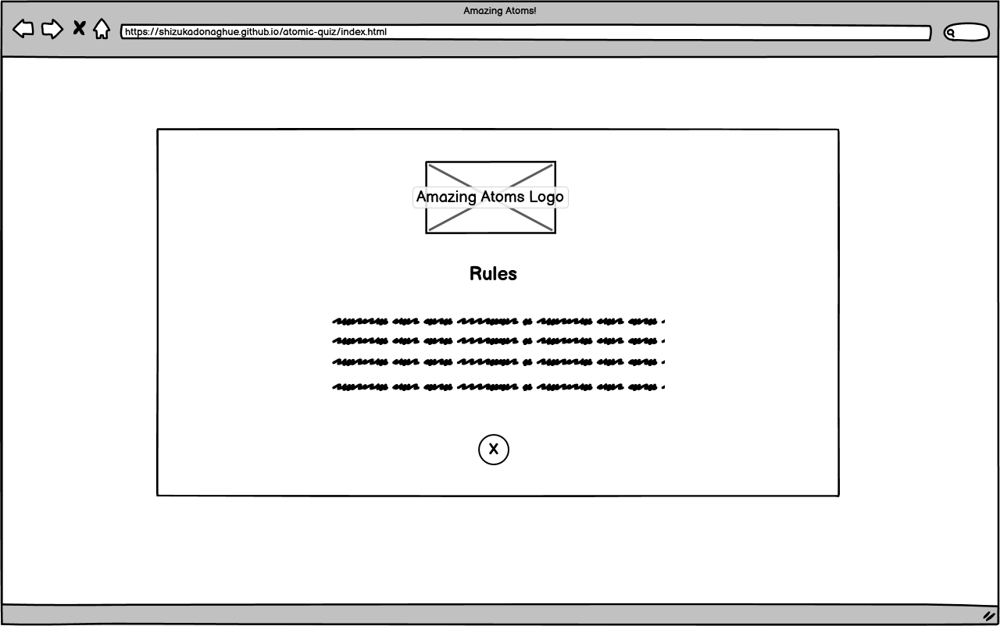
  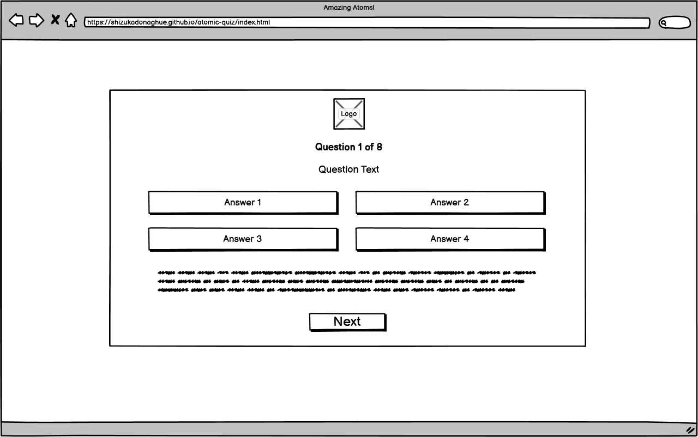
  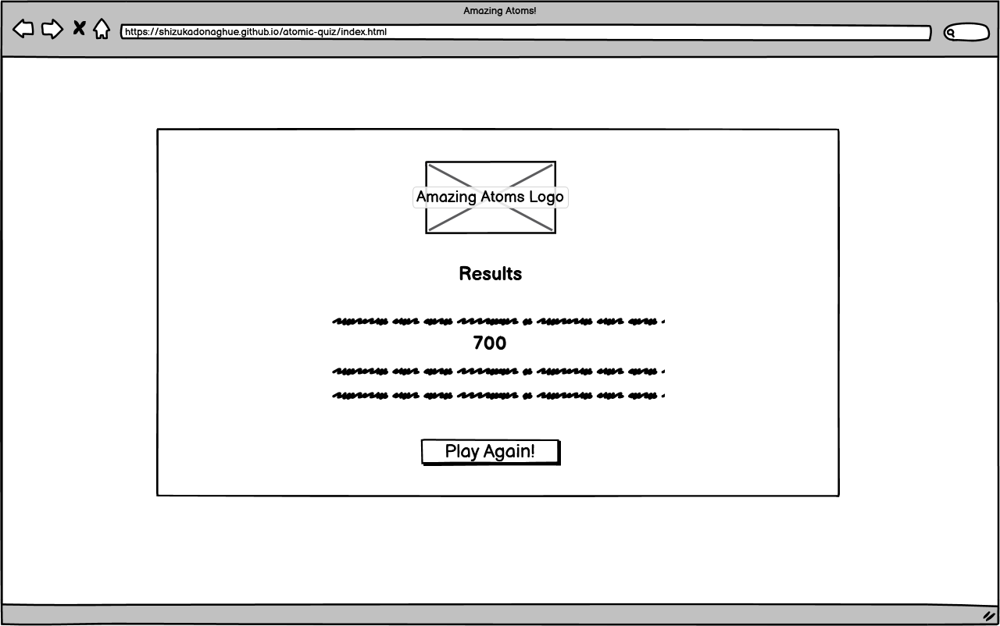
  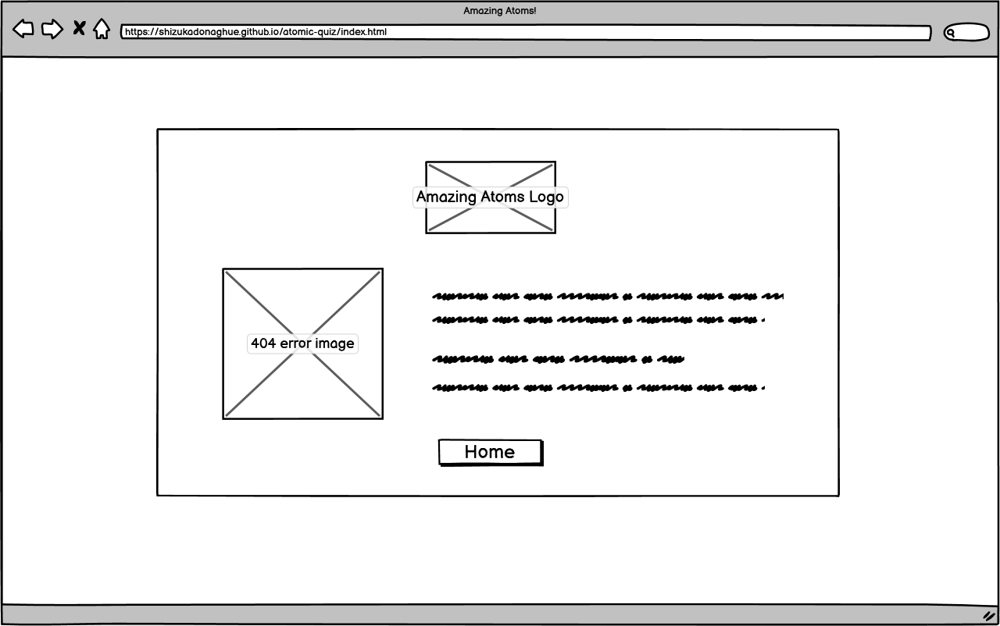

  

### Colour Scheme

### Typography

### Features

#### Existing Features

#### Feasures Left to Implement

### Technologies Used
#### Languages
* [HTML](https://html.spec.whatwg.org/) was used to create the contents and structure for the website.
* [CSS](https://www.w3.org/Style/CSS/Overview.en.html) was used to add styling to the website.
* [JavaScript](https://en.wikipedia.org/wiki/JavaScript) was used to create interactive contents for the website. 

#### Tools used for Developing the Website
* [Gitpod](https://www.gitpod.io/) was used to create, edit and preview the codes during development.
* [Git](https://git-scm.com/) was used for version control and tracked changes in the codes.
* [GitHub](https://github.com/) was used to store the codes and deploy the website.
* [Chrome Dev Tools](https://developer.chrome.com/docs/devtools/) were used extensively while adjusting the objects in the website for different screen sizes.
* [balsamiq](https://balsamiq.com/) was used to generate wireframes for the website.

#### Tools used for Styling the Website
* The logo was designed by the developer with [Wix](https://www.wix.com/).
* The favicon was created from the logo with [RealFaviconGenerator](https://realfavicongenerator.net/).
* The font used in the website is imported from [Google Fonts](https://fonts.google.com/).
* The website uses icons from [Font Awesome](https://fontawesome.com/).
* The website uses [cdnjs.com](https://cdnjs.com/) for Font Awesome icons so that the website loads quickly.
* The colour scheme ideas and actual colour palette were generated with [Coolors.co](https://coolors.co/).
* [remove.bg](https://www.remove.bg/) was used to remove the background from the 404 error image and the favicon.

#### Tools used for Validating the Website
* [W3C HTML Validator](https://validator.w3.org/) was used to validate HTML codes.
* [W3C CSS Validator](https://validator.w3.org/) was used to validate CSS codes.
* [JSHint](https://jshint.com/) was used to validate JavaScript codes.
* [a11y Color Contrast Accessibility Validator](https://color.a11y.com/Contrast/) was used to check the colour contrast for accessibility.

#### Other Online Resources used 
* [Commpressor.io](https://compressor.io/) was used to compress the images for the website so that the website loads quickly.
* [Multi Device Website Mockup Generator](https://techsini.com/multi-mockup/index.php) was used to generate the mockup image showing the website on various screen sizes.
* [Grammarly](https://app.grammarly.com/) was used to fix grammatical errors across the website.

### Testing

#### Code Validation

#### Lighthouse

#### Browser Compatibility

#### Responsiveness

#### User Stories

#### Resolved Bugs

#### Unresolved Bugs

### Deployment
#### Deploying a GitHub Repository to GitHub Pages
#### Forking the GitHub Repository
#### Creating a Local Clone

### Credits
#### Content
* Quiz questions and answers were sourced from [ThoughtCo.](https://www.thoughtco.com/what-do-you-know-about-atoms-609620).

#### Media
* The background image for the website was sourced from [pixabay.com](https://pixabay.com).
* The 404 error image was sourced from [freepik](https://www.freepik.com/).

#### Codes
* The code to randomise a Javascript array in script.js was from [JavaScript.info](https://javascript.info/task/shuffle).
* The code for box-shadow in style.css was from [CSS Scan](https://getcssscan.com/css-box-shadow-examples).

### Acknowledgements
