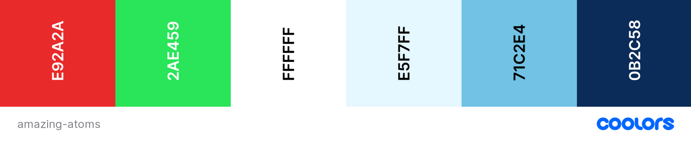
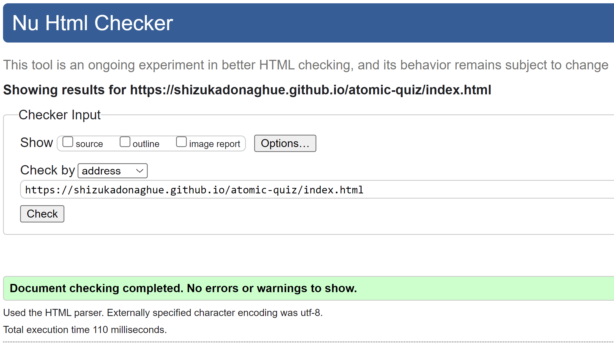
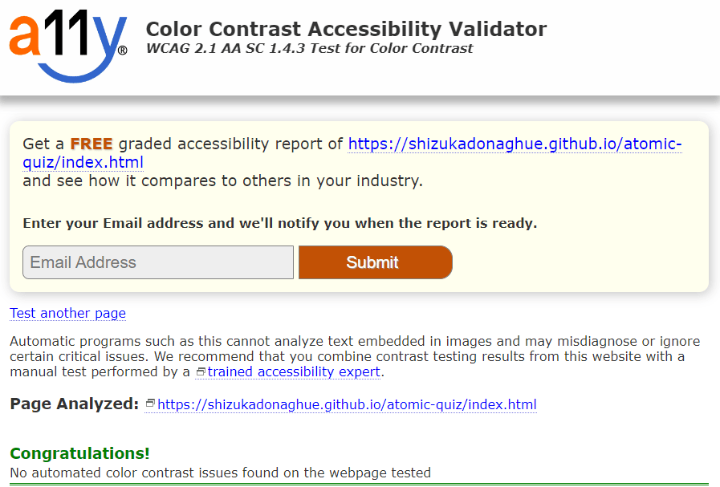

# Amazing Atoms

Welcome to Amazing Atoms! Amazing Atoms is an interactive quiz game where users can test and improve their knowledge about atoms. There are four possible answers for each question and once the user selects an answer, the correct answer is shown and explained for each question, so they can learn about atoms as they play! 

## Live Website
[Amazing Atoms](https://shizukadonaghue.github.io/atomic-quiz/)

## Repository
<https://github.com/ShizukaDonaghue/atomic-quiz>

## UX & Design
### Overview
Amazing Atoms has been designed to help users test and improve their knowledge about atoms, regardless of their level of knowledge. The overall objective of the game is for users to have some fun while they learn about atoms.  

### User Stories
As a user,
* I would like to test and improve my knowledge about atoms
* I would like a clean and uncluttered website that is intuitive and easy to navigate
* I would like to be able to play the game on any devices
* I would like to understand how to play the game
* I would like clear visual feedback when I submit my answer so that I know whether my answer is correct
* I would like to know how well I did in the game when finished
* I would like to be able to quit or restart the game at any point

### Website Structure
The website consists of two HTML pages. The main page contains all the contents related to the game and the second page is used in case of 404 error. 

With the contents of the game being on a single HTML page, JavaScript codes in script.js are used to hide and unhide sections of the main page based on the interactions with the user. For example, the landing page is the start section of the main page and when the user clicks on the start button to play the game, the start section is hidden and the game section is displayed. Once the game is initiated, a series of randomised questions is displayed which are stored in questions.js file. 

### Wire Frames
Wireframes were generated using [balsamiq](https://balsamiq.com/) to visualise the structure of the website. The structure of the finished website is slightly different from the wireframes due to development that occurred during the building process, however, it largely remained the same.

  
Mobile

  

  
Tablet

  
  
  
  
  

  
Desktop

  
  
  
  
  
  

  
### Colour Scheme
The colour scheme for the website has taken inspiration from the background image of atoms. The light blue E5F7FF is used as the background colour for all the contents and the dark navy 0B2C58 is used for texts so that it contrasts well with the background colour. The dark navy is also used for the buttons with texts in white FFFFFF and the lighter blue 71C2E4 is used for hover effects on the control buttons. 

Red E92A2A and green 2AE459 are used for the answer buttons to indicate whether the answer selected by the user is correct. 

This colour scheme is consistent throughout the website and intended to provide a clean and scientific feel with the background image of atoms.

### Typography
The font used throughout the website is Ubuntu which is imported from [Google Fonts](https://fonts.google.com/). It is easy to read and suits the image of the website.

## Features
### Existing Features
#### Logo
The logo for the website features an image of an atom and the name of the website. There are two versions of the logo and the main logo is used all sections, except for the game section where the smaller one is used to allow more space for the game contents. The logos are linked to the start section of the main page so that the user can easily navigate back to the start section, or restart the game while playing the game.

#### Favicon
The favicon was created from the logo to help the user locate the website easier when they have multiple tabs open in their browser. 

#### Start Section (Landing Page)
The start section of the main page is the landing page for the website. It includes an introduction to the game and a name input field. The question mark next to the name input field displays the requirements for the name input field, which are validated with JavaScript codes in scripts.js so that the game is only initiated once the user provides a name that satisfies the requirements. If the name provided does not satisfy the requirement, an alert is displayed to let the user know the requirements. The name provided here is stored and used in the result page to provide a more personal feel when the game is finished. 

From this page, the user can either view the rules or start the game.

#### Rule Section
This section explains the rules of the game and how the score is calculated. The user can go back to the start section by either clicking on the "X" button at the bottom or the logo at the top.

#### Game Section
There are 8 questions in total and they are shuffled for each game. The current number of question is displayed at the top to let the user know their progress in the game.

There are 4 possible answers for each question and once the user selects an answer, the correct answer turns green and if the user's answer is incorrect, the selected answer turns red to provide visual feedback to the user as they play the game. Once an answer is selected, answer buttons are disabled, so only the first answer is considered for each question.

When the answer is revealed, the answer is also explained below the answer buttons, so that the user can learn more about atoms to improve their knowledge.

The "Next" button is only displayed once the user selects an answer, so the user must select an answer before they can progress to the next question. 

If the user decides to quit or restart the game, they can easily navigate back to the start section by clicking on the logo. 

#### Result Section
When the user finishes the game, the result page is displayed and lets the user know how well they have done in the game. The name entered at the start of the game is used here to personalise the message. Depending on the score, different messages are displayed to encourage the user to play the game again to improve their knowledge. 

The final score includes animation to scale up and down to add some drama to the section.

The "Play Again!" button resets the game and shuffles the questions, and takes the user back to a new first question. 

If the user decides to restart the game, they can do so by clicking on the logo which takes them back to the start section where they can enter a new name and start a new game.

#### 404 Error Page
In case of 404 error, this 404 error page is displayed. It features the logo and the "Home" button. The user can click on either of these to easily navigate back to the start section. 

### Features Left to Implement
 The website currently contains a set of 8 questions. It will benefit by having additional sets of questions for different difficulty levels that the user can choose from. The current set of questions will be categorised as "Easy" and as the user improve their knowledge, they can progress to a "Medium" or "Hard" set of questions to further improve their knowledge of atoms. This will be a nice feature to be added in the future.

## Technologies Used
### Languages
* [HTML](https://html.spec.whatwg.org/) was used to create the contents and structure for the website.
* [CSS](https://www.w3.org/Style/CSS/Overview.en.html) was used to add styling to the website.
* [JavaScript](https://en.wikipedia.org/wiki/JavaScript) was used to create interactive contents for the website. 

### Tools used for Developing the Website
* [Gitpod](https://www.gitpod.io/) was used to create, edit and preview the codes during development.
* [Git](https://git-scm.com/) was used for version control and tracked changes in the codes.
* [GitHub](https://github.com/) was used to store the codes and deploy the website.
* [Chrome Dev Tools](https://developer.chrome.com/docs/devtools/) were used extensively while adjusting the objects in the website for different screen sizes.
* [balsamiq](https://balsamiq.com/) was used to generate wireframes for the website.

### Tools used for Styling the Website
* The logo was designed by the developer with [Wix](https://www.wix.com/).
* The favicon was created from the logo with [RealFaviconGenerator](https://realfavicongenerator.net/).
* The font used in the website is imported from [Google Fonts](https://fonts.google.com/).
* The website uses icons from [Font Awesome](https://fontawesome.com/).
* The website uses [cdnjs.com](https://cdnjs.com/) for Font Awesome icons so that the website loads quickly.
* The colour scheme ideas and actual colour palette were generated with [Coolors.co](https://coolors.co/).
* [remove.bg](https://www.remove.bg/) was used to remove the background from the 404 error image and the favicon.

### Tools used for Validating the Website
* [W3C HTML Validator](https://validator.w3.org/) was used to validate HTML codes.
* [W3C CSS Validator](https://validator.w3.org/) was used to validate CSS codes.
* [JSHint](https://jshint.com/) was used to validate JavaScript codes.
* [a11y Color Contrast Accessibility Validator](https://color.a11y.com/Contrast/) was used to check the colour contrast for accessibility.

### Other Online Resources used 
* [Commpressor.io](https://compressor.io/) was used to compress the images for the website so that the website loads quickly.
* [Multi Device Website Mockup Generator](https://techsini.com/multi-mockup/index.php) was used to generate the mockup image showing the website on various screen sizes.
* [Grammarly](https://app.grammarly.com/) was used to fix grammatical errors across the website.

## Testing
### Code Validation
The website has been fully validated to ensure there were no syntax errors. The official [W3C HTML Validator](https://validator.w3.org/), [W3C CSS Validator](https://jigsaw.w3.org/css-validator/) and [JSHint](https://jshint.com/) were used for the validation and no errors were found.

  
Validation Results for index.html

  

  
Validation Results for 404.html
  
  

  
Validation Results for style.css

  
  

  
Validation Results for script.js

    

  The results show an undefined variable "questions." This is because this variable is declared in questions.js file.

  
Validation Results for questions.js

    

  The results show an unused variable "questions." This is because this variable is used in script.js file.

 

### Accessibility
The website has been validated for colour contrast accessibility using [a11y Color Contrast Accessibility Validator](https://color.a11y.com/Contrast/) and no issues were found.

  
Validation Results for index.html

    

  
Validation Results for 404.html

    

### Lighthouse

### Responsiveness
Responsiveness was tested using [Chrome Dev Tools](https://developer.chrome.com/docs/devtools/) and no issues were found. This included the following devices:
* iPhone 5/SE, 6/7/8, 6/7/8 Plus, SE, XR, 12 Pro, and X
* iPad Air and iPad Mini
* Samsung Galaxy S8+, S9+, S20 Ultra, A51/71
* Microsoft Surface Pro 7 and Duo
* Nest Hub and Hub Max

### Manual Testing 
Manual testing was undertaken on the following browers:
* Google Chrome
* Microsoft Edge
* Apple Safari
* Mozilla Firefox
* Opera

The following have been tested to verify that all the features function as expected.   

#### Start Section 
* Name Inpunt Field
    * The name input field only accepts a username that consists of a minimum of 3 and a maximum of 10 letters without any spaces
    * If the username entered does not meet the requirements, the alert is displayed to let the user know the requirements
    * Focus method is applied to place the cursor in the field if the screen size is >= 768px and is not applied otherwise
* Question Mark for Input Help
    * The input help is displayed with mouseover event and hidden with mouseleave event in desktop
    * The input help is displayed and hidden with click events in desktop and mobile devices
* Start Button
    * The colour of the button changes and scales up upon hovering
    * When clicked with a username that satisfies the name input field requirements, it starts the game and displays the game section and all other sections are hidden
    * When clicked with a username that does not satisfies the requirements, it does not start the game
* Rule Button
    * The colour of the button changes and scales up upon hovering
    * When clicked, the rule section is displayed and all other sections are hidden

#### Rule Section
* Logo
    * The logo is linked to the start section
* The "X" icon
    * The "X" is linked to the start section
    * The colour of the button changes upon hovering

#### Game Section
* Logo 
    * The logo scales up upon hovering to indicate that is a link
    * The log is linked to the start section so that the user can quit or restart the game
* Question Number
    * Question number increments by one for each question
* Questions
    * Questions are shuffled for each game
    * Question text is displayed for each question and the correct set of possible answers are displayed for the question
* Answers Buttons
    * When the user selects an answer, the correct answer button turns green
    * If the user's answer is incorrecct, the answer button turns red
    * Once the user selects an answer, all the answer buttons are disabled so that only the first answer is considered
    * Once the user selects an answer, cursor: pointer property is removed to be more intuitive
    * Text contents fit within the buttons and do not overflow outside the buttons 
* Answer Explanation Text
    * Once the user selects an answer, the answer explanation text is displayed
    * Text contents fit within the space and do not overflow outside the space provided
* Next Button
    * The colour of the button changes upon hovering
    * The button is only displayed once the user selects an answer to prevent the user from skipping questions
    * When clicked, it reactivates the answer buttons and cursor: pointer property for the next question
    * When clicked, it removes the colours (red or green) from the answer buttons for the next question
    * When clikced, it hides the next button and answer explanation text for the next question 
    * If it is the last question, the next button is not displayed and instead the finish button is displayed
* Finish Button
    * The colour of the button changes upon hovering
    * The finish button is displayed once the user selects an answer for the last question
    * When clicked, it displays the results section and hides all other section

#### Results Section
* Logo 
    * The log is linked to the start section so that the user can restart the game with a new username
* Username
    * The username provided at the start of the game is displayed when the game is finished
* The Number of Correct Answers
    * The number of correct answers is calculated corretly and displayed
* Final Score
    * The final score is calculated correctly and displayed
    * The final score scales up and down with the animation feature
* Final Results
    * Depending on the final score, displays different messages - check all messages for final score <= 1, <= 2, <= 5 and <= 6
* Play Again Button
    * The colour of the button changes and scales up upon hovering
    * When clikced, reset the number of questions, correct answers and scores
    * When clicked, shuffles the questions and prepares for a new game
    * When clicked, it displays the new first question in the game section and hides all other sections

#### 404 error page
* Logo 
    * The log is linked to the start section
* Home Button
    * The colour of the button changes upon hovering
    * The log is linked to the start section

### Physical Testing
The website was also physically tested on iPhone 12, iPhone XR, iPad 8, HP Elitebook 840, and Dell XPS for the above. No issues were found.

### User Stories

### Resolved Bugs

### Unresolved Bugs

## Deployment
### Deploying a GitHub Repository to GitHub Pages
### Forking the GitHub Repository
### Creating a Local Clone

## Credits
### Content
* Quiz questions and answers were sourced from [ThoughtCo.](https://www.thoughtco.com/what-do-you-know-about-atoms-609620).

### Media
* The background image for the website was sourced from [pixabay.com](https://pixabay.com).
* The 404 error image was sourced from [freepik](https://www.freepik.com/).

### Codes
* The code to randomise a Javascript array in script.js was from [JavaScript.info](https://javascript.info/task/shuffle).
* The pattern to check for all letters in script.js was from [w3resource](https://www.w3resource.com/javascript/form/all-letters-field.php).
* The code for box-shadow in style.css was from [CSS Scan](https://getcssscan.com/css-box-shadow-examples).

## Acknowledgements
